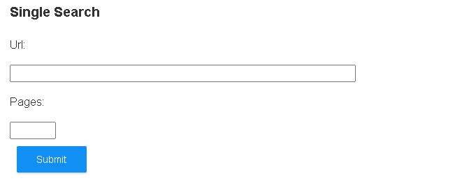
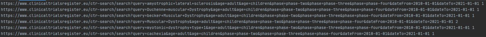

# Eu-Clinical-Trial-Web-Scraper

## About
* Scrapes all the info from a search on https://www.clinicaltrialsregister.eu
* [GO HERE](http://eu-clinical.donkirk.net/)  

## Single Search
Copy the link from the search results from the clinical trials register page.  
[Example](https://www.clinicaltrialsregister.eu/ctr-search/search?query=amyotrophic+lateral+sclerosis&age=adult&phase=phase-two&phase=phase-three&phase=phase-four&dateFrom=2010-01-01&dateTo=2021-01-01)  

--------------------------------------------------------------------------------
## Multiple Searches
Similar to the Single search, Multiple Search option allows the user to search more than one search in one go.
You need a text file(.txt) with the same parameters as the single search.  

Each line has the search url and page number  
In the example below you see the search url and the page number "1" because thats how many pages I want to scrape per request.

--------------------------------------------------------------------------------
## Cross Search
* Two excel files are required
* Removes any records from the EU excel file that matches the US excel file
  * Compares on US otherId and EU SponsorProtocolNumber
  
Below these headers are **required!**

#### EU Excel Headers
* EudraCT Number
* Sponsor Protocol Number
* Start Date
* Sponsor Name
* Full Title
* Medical Condition
* Disease
* Population Age
* Gender
* Trial Protocol
* Trial Results
* Primary End Points
* Secondary End Points

#### US Excel Headers
* rank 
* ntcNumber 
* title 
* acronym 
* status 
* studyResults 
* condition 
* intervention 
* outcomeMeasure 
* sponsor 
* gender 
* age 
* phases 
* enrollment
* fundedBy
* studyType
* studyDesign
* otherId
* startDate
* primaryCompletionDate
* completionDate
* firstPosted
* resultFirstPosted
* lastUpdatePosted
* locations
* studyDocuments
* url
